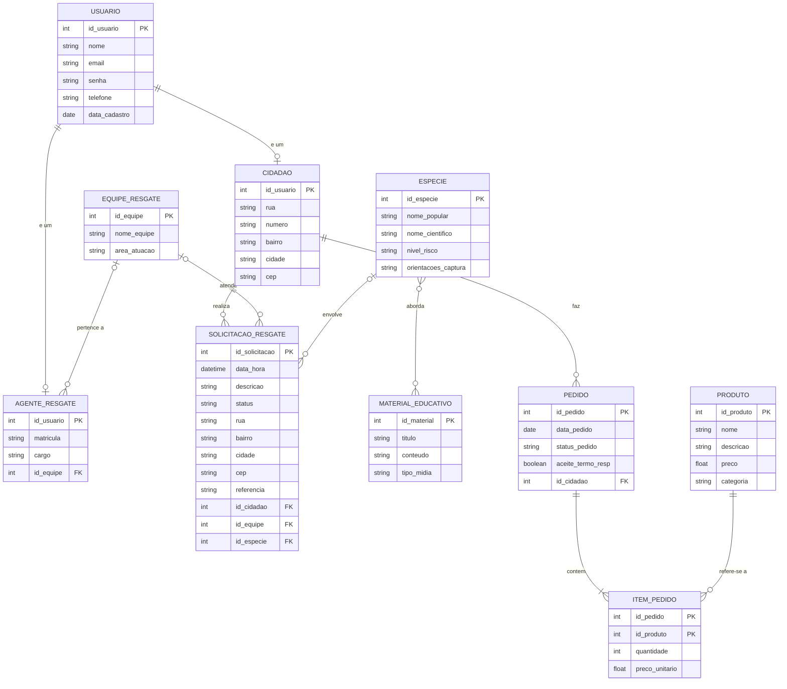

# DER — Diagrama Entidade-Relacionamento

```mermaid
erDiagram
    USUARIO ||--o| CIDADAO : "e um"
    USUARIO ||--o| AGENTE_RESGATE : "e um"
    EQUIPE_RESGATE |o--o{ AGENTE_RESGATE : "pertence a"
    CIDADAO ||--o{ SOLICITACAO_RESGATE : realiza
    EQUIPE_RESGATE |o--o{ SOLICITACAO_RESGATE : atende
    ESPECIE |o--o{ SOLICITACAO_RESGATE : envolve
    ESPECIE }o--o{ MATERIAL_EDUCATIVO : aborda
    CIDADAO ||--o{ PEDIDO : faz
    PEDIDO ||--|{ ITEM_PEDIDO : contem
    PRODUTO ||--o{ ITEM_PEDIDO : "refere-se a"

    USUARIO {
        int id_usuario PK
        string nome
        string email
        string senha
        string telefone
        date data_cadastro
    }
    CIDADAO {
        int id_usuario PK
        string rua
        string numero
        string bairro
        string cidade
        string cep
    }
    AGENTE_RESGATE {
        int id_usuario PK
        string matricula
        string cargo
        int id_equipe FK
    }
    EQUIPE_RESGATE {
        int id_equipe PK
        string nome_equipe
        string area_atuacao
    }
    SOLICITACAO_RESGATE {
        int id_solicitacao PK
        datetime data_hora
        string descricao
        string status
        string rua
        string bairro
        string cidade
        string cep
        string referencia
        int id_cidadao FK
        int id_equipe FK
        int id_especie FK
    }
    ESPECIE {
        int id_especie PK
        string nome_popular
        string nome_cientifico
        string nivel_risco
        string orientacoes_captura
    }
    MATERIAL_EDUCATIVO {
        int id_material PK
        string titulo
        string conteudo
        string tipo_midia
    }
    PRODUTO {
        int id_produto PK
        string nome
        string descricao
        float preco
        string categoria
    }
    PEDIDO {
        int id_pedido PK
        date data_pedido
        string status_pedido
        boolean aceite_termo_resp
        int id_cidadao FK
    }
    ITEM_PEDIDO {
        int id_pedido PK
        int id_produto PK
        int quantidade
        float preco_unitario
    }
```
